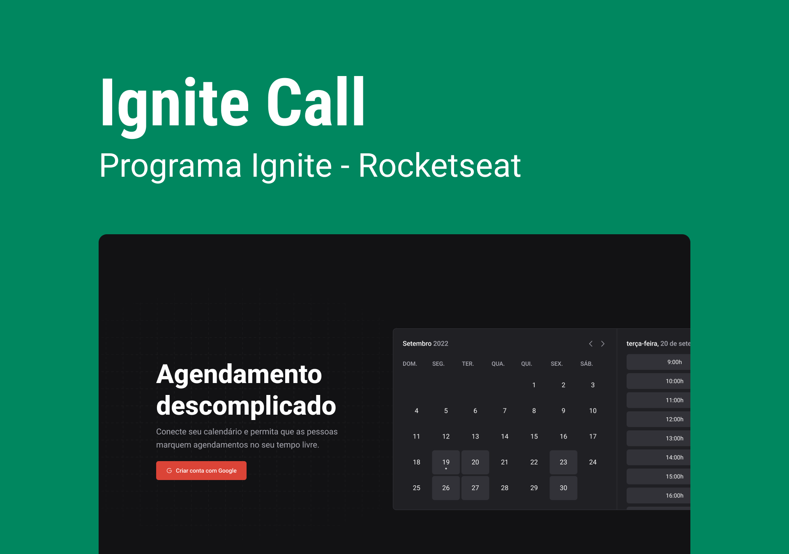

<h1 align="center">
  📅 Ignite Call
</h1>


<p align="center">
  

  

  <a href="https://github.com/amanda-santos/ignite-call/commits/master">
    
  </a>

  <a href="https://github.com/amanda-santos/ignite-call/issues">
    
  </a>
</p>

<p align="center">
  <a href="#-about-the-project">About the project</a>&nbsp;&nbsp;&nbsp;|&nbsp;&nbsp;&nbsp;
  <a href="#-layout">Layout</a>&nbsp;&nbsp;&nbsp;|&nbsp;&nbsp;&nbsp;
  <a href="#-technologies">Technologies</a>&nbsp;&nbsp;&nbsp;|&nbsp;&nbsp;&nbsp;
  <a href="#-preview">Preview</a>&nbsp;&nbsp;&nbsp;|&nbsp;&nbsp;&nbsp;
  <a href="#-getting-started">Getting started</a>&nbsp;&nbsp;&nbsp;|&nbsp;&nbsp;&nbsp;
  <a href="#-how-to-contribute">How to contribute</a>&nbsp;&nbsp;&nbsp;
</p>

## 📝 About the project

<p>Ignite Call is an application where you can create your account and generate a dynamic page where people can schedule meetings with you. Fully integrated with Google Calendar 📅 and available in Portuguese 🇧🇷.
Developed during <b>Ignite React.js</b> by <a href="https://rocketseat.com.br/">Rocketseat</a>.</p>
</p>

## 🎨 Layout

<p>
  Click <a href="https://www.figma.com/file/KA6SXd3MxV8Z2lid5ha2CH/Ignite-Call-(Copy)?node-id=0%3A1&t=WanzRngfe1Bbcnmd-1">here</a> to check the layout on Figma.
</p>

## 👩🏻‍💻 Technologies

Technologies used to develop this project:
- Typescript
- React.js
- Next.js
- React Hook Form
- Zod
- Next Auth
- Next SEO
- Google API
- Prisma
- React Query
- Axios
- DayJS

## 🖥 Preview

📺 Click <a href="https://ignite-call-amanda-santos.vercel.app/">here</a> to see a live preview.

https://user-images.githubusercontent.com/49074930/219811289-e4fb2a68-895b-4344-a5a1-91d1bdc249d4.mp4

## ⌨ Getting started

- Run `npm i` to install the dependencies
- Create a local MySQL database with `docker run --name mysql -e MYSQL_ROOT_PASSWORD=docker -p 3306:3306 mysql:latest`
- Run the migrations with `npx prisma migrate dev`
- Open the application with `npm run dev`
- Open the Prisma Studio with `npx prisma studio`

## 🤔 How to contribute

**Make a fork of this repository**

```bash
# Fork using GitHub official command line
# If you don't have the GitHub CLI, use the web site to do that.

$ gh repo fork amanda-santos/ignite-call
```

**Follow the steps below**

```bash
# Clone your fork
$ git clone your-fork-url && cd ignite-call

# Create a branch with your feature
$ git checkout -b my-feature

# Make the commit with your changes
$ git commit -m 'feat: My new feature'

# Send the code to your remote branch
$ git push origin my-feature
```

After your pull request is merged, you can delete your branch

---

Made with 💚 by Amanda Santos
